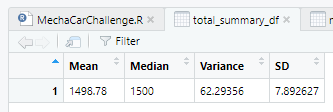
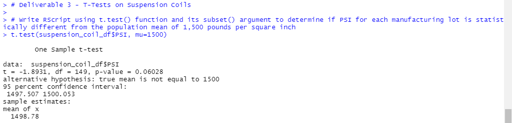

# MechaCar_Statistical_Analysis

## Overview
Using R, analyze MechaCar & how it compares to the competition.

## Linear Regression to Predict MPG

- Which variables/coefficients provided a non-random amount of variance to the mpg values in the dataset?
  - ground_clearance (P-value = 5.21e-08) and vehicle_length (P-value = 2.60e-12)
- Is the slope of the linear model considered to be zero? Why or why not?
  - The slope of the linear model cannot be considered to be zero, because the P-value (5.35e-11) is significant & we can reject our null hypothesis.
- Does this linear model predict mpg of MechaCar prototypes effectively? Why or why not?
 - The multiple R-squared is 0.7149, which means that this model explains 71% of the variance in the dataset. This R-squared is high enough for us to be confident.

## Summary Statistics on Suspension Coils
Total Summary:

Lot Summary:

- Manufacturing Lot #3 stands out with significantly higher variance and SD stats compared to Lot #1 & Lot #2.
  - Lot #3's variance is 170.286 and it's SD is 13.049, much higher than those of Lot #2's variance of 7.469 & SD of 2.733, and Lot #1's variance of 0.979 and SD of 0.989.
    - This is the cause of the increased variance in the total summary dataframe.
      - Variance of total summary is 62.293, which falls inside of 100 pounds per square inch criteria.
    - Lot #3 variance 170.286 is outside of 100 pounds per square inch.
- Manufacturing Lot #2 is doing fine, but could improve it's variance of 7.469 to be closer to that of Lot #1's 0.979.
- Whoever is running Lot #1 should take over Lot #3 to fix the variance issues in MechaCar's suspension coils. 

## T-Tests on Suspension Coils
T-Test Whole Population:

- T-Test of all manufacturing lots has a P-value of 0.06, not low enough to reject the null hypothesis.
  - Mean of x 1498.78 is close to population mean of 1500.

T-Test Manufacturing Lot #1:

- T-Test of Manufacturing Lot #1 has a P-value of 1, not low enough to reject the null hypothesis.
  - Manufacturing Lot #1 has no statistically significant difference from population mean 1500.

T-Test Manufacturing Lot #2:

- T-Test of Manufacturing Lot #2 has a P-value of 0.6072, also not low enough to reject the null hypothesis.
  - Manufacturing Lot # 2 has no statistically significant difference from population mean 1500.

T-Test Manufacturing Lot #3:

- T-Test of Manufacturing Lot #3 has a P-value of 0.041, which is low enough to reject the null hypothesis.
  - Manufacturing Lot #3 has a slight statistical difference from the population mean 1500.

## Study Design: MechaCar vs Competition
- What metric or metrics are you going to test?
  - Highway vs city mpg (fuel efficiency on highway road type & city road type)
- What is the null hypothesis or alternative hypothesis?
  - Null hypothesis = no statistical difference and mpg considered equal.
  - Alternative hypothesis = statistical difference and one car has a different average mpg.
- What statistical test would you use to test the hypothesis? And why?
  - ANOVA can show statistical difference in mpg, because it would compare the average of continuous variables.
- What data is needed to run the statistical test?
  - MechaCar & competitor statistics
  - The contiuous variable needed for the ANOVA test would be mpg since it is continuous.
  - 